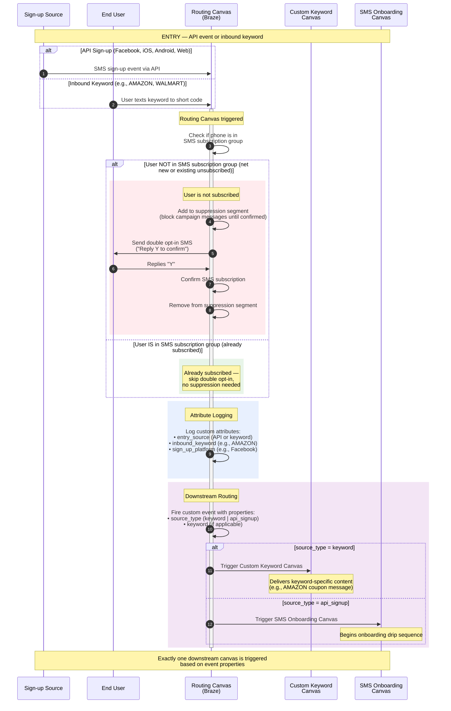
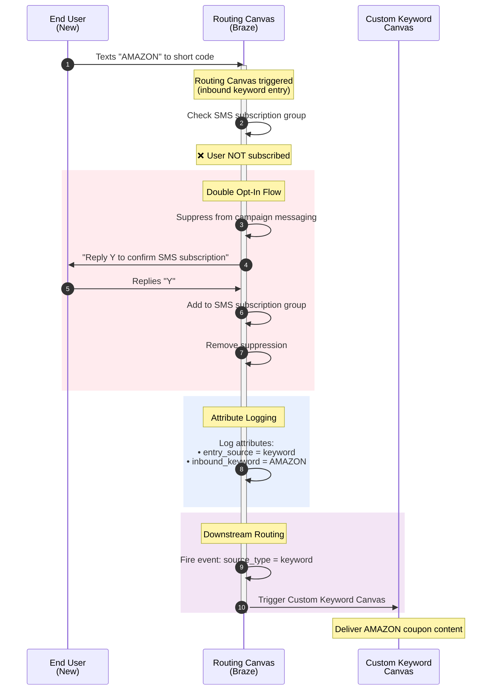
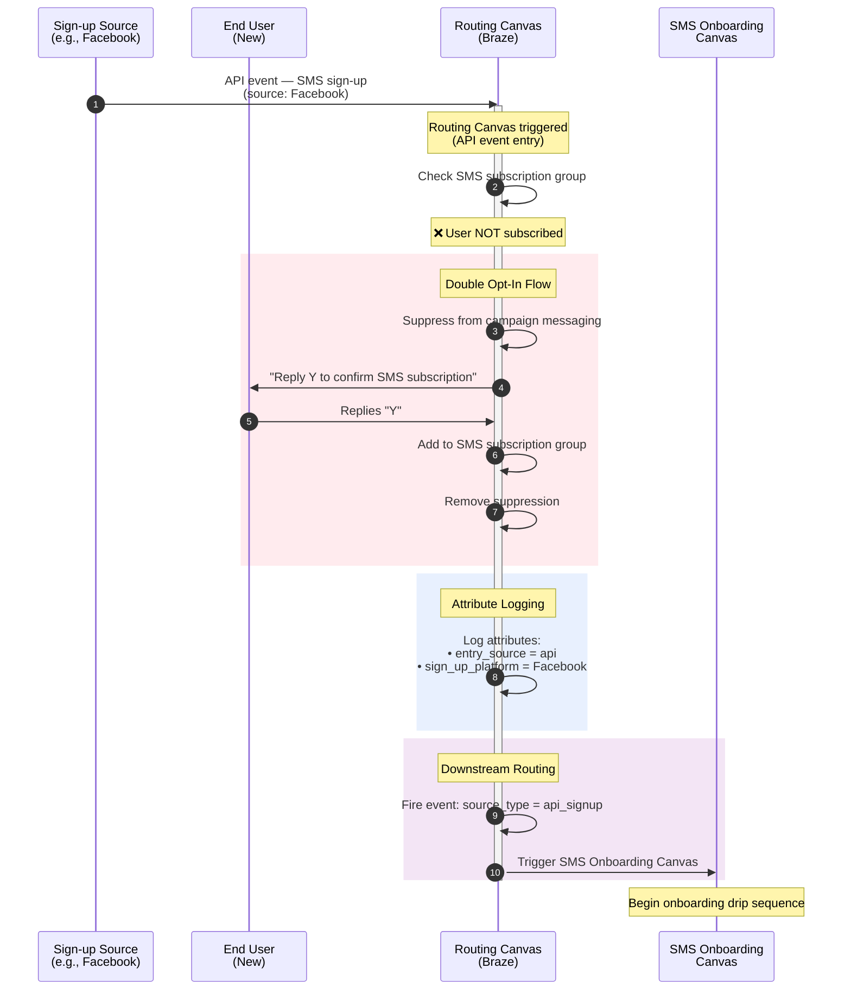
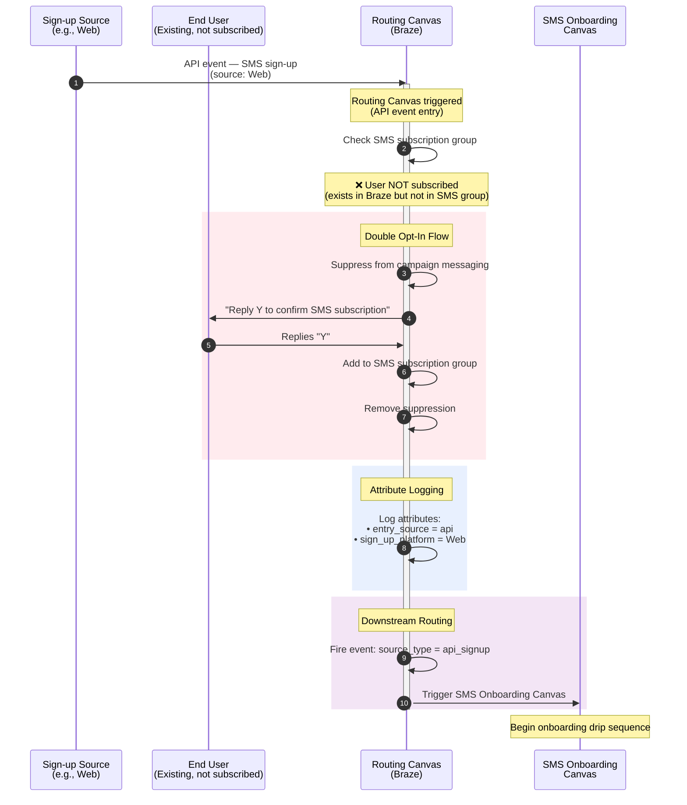
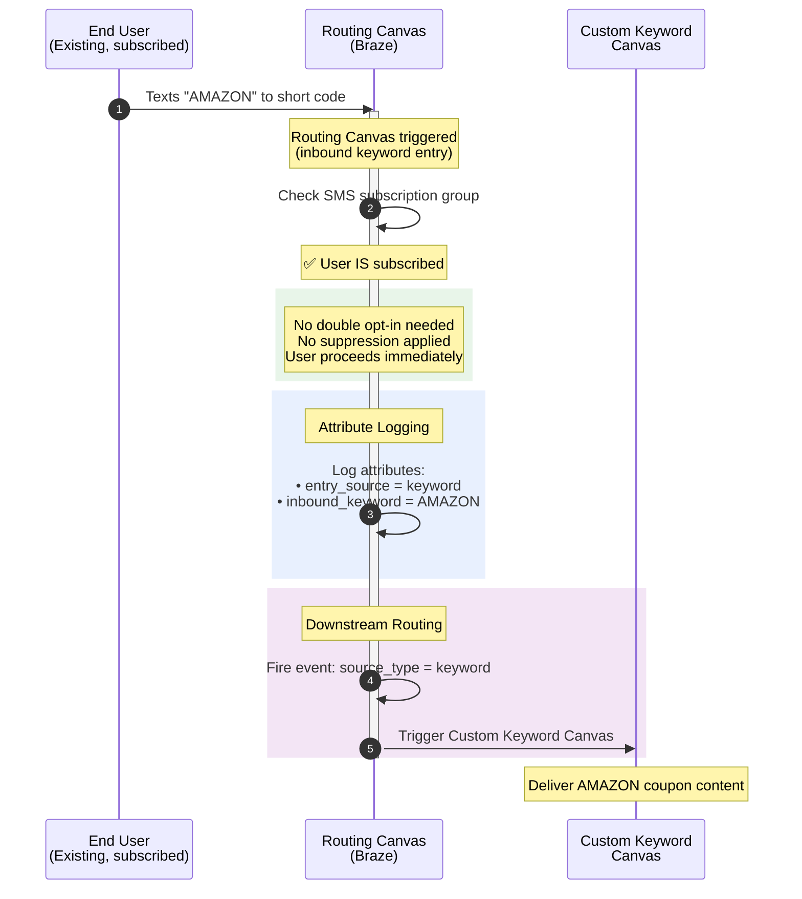
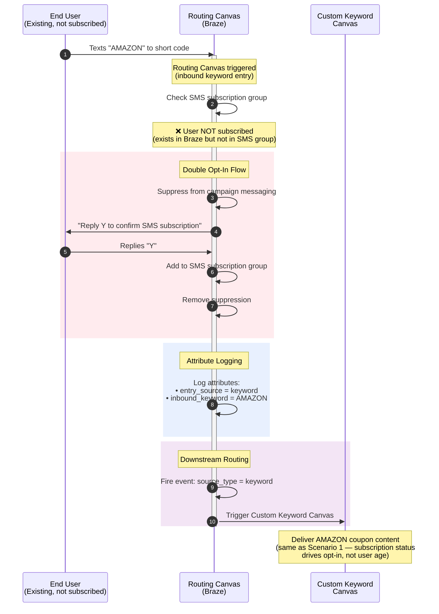

# Braze SMS Opt-In Routing Canvas — Sequence Diagrams

This document describes the **single Routing Layer Canvas** that acts as the entry point for all SMS sign-ups. The diagrams below cover the double opt-in orchestration, attribute logging, and downstream routing logic across five key scenarios.

---

## Participants

| Actor | Description |
|---|---|
| **Sign-up Source** | External trigger origin — API events from Facebook, iOS, Android, Web, or an inbound keyword |
| **End User** | The person signing up or texting a keyword |
| **Routing Canvas (Braze)** | The single entry-point canvas that manages opt-in checks, double opt-in, attribute logging, and downstream routing |
| **Custom Keyword Canvas** | Downstream canvas for keyword-specific content (e.g., AMAZON coupon) |
| **SMS Onboarding Canvas** | Downstream canvas for general SMS onboarding sequences |

---

## Comprehensive Overview

This diagram shows the complete routing logic with all branching paths.

---

## Scenario Diagrams

### Scenario 1 — New user texts coupon keyword before double opt-in

A brand-new user (not in Braze or not in the SMS subscription group) texts a keyword like **AMAZON**. They must complete the double opt-in before receiving keyword content.

---

### Scenario 2 — New user subscribes through standard API double opt-in

A new user signs up via an API source (e.g., Facebook lead form, website form). They go through double opt-in and enter the general onboarding sequence.

---

### Scenario 3 — Existing user (not subscribed) subscribes through standard API double opt-in

An existing Braze user who is **not** in the SMS subscription group signs up via an API source. The flow mirrors Scenario 2 — subscription status drives behavior, not user age.

---

### Scenario 4 — Existing user (already subscribed) texts coupon keyword

An existing user who is **already subscribed** to SMS texts a keyword like **AMAZON**. They bypass double opt-in entirely and go straight to keyword content.

---

### Scenario 5 — Existing user (not subscribed) texts coupon keyword before double opt-in

An existing Braze user who is **not subscribed** to SMS texts a keyword like **AMAZON**. They must complete double opt-in first, then receive keyword content.

---

## Scenario Summary Matrix

| # | User Status | SMS Subscribed? | Entry Type | Double Opt-In? | Downstream Canvas |
|---|---|---|---|---|---|
| 1 | New | No | Keyword (AMAZON) | Yes | Custom Keyword Canvas |
| 2 | New | No | API (Facebook) | Yes | SMS Onboarding Canvas |
| 3 | Existing | No | API (Web) | Yes | SMS Onboarding Canvas |
| 4 | Existing | Yes | Keyword (AMAZON) | No | Custom Keyword Canvas |
| 5 | Existing | No | Keyword (AMAZON) | Yes | Custom Keyword Canvas |

### Key Takeaway

The **SMS subscription status** — not whether the user is "new" or "existing" in Braze — determines whether the double opt-in flow is triggered. The **entry type** (keyword vs. API sign-up) determines which downstream canvas is activated.

---

## Next Steps

### 1. Create and Configure the Routing Canvas
- Build the single Routing Canvas in Braze with two entry triggers:
  - **API-triggered entry** for sign-ups from Facebook, iOS, Android, and Web
  - **Inbound keyword entry** for custom keyword responses
- Add a **Decision Split** step checking SMS subscription group membership
- Configure the **double opt-in message step** with a "Reply Y to confirm" template
- Add a **User Update** step to add confirmed users to the SMS subscription group
- Implement **suppression logic** (add to suppression segment on entry for unsubscribed users; remove upon confirmation)
- Add **Custom Attribute** steps to log `entry_source`, `inbound_keyword`, and `sign_up_platform`
- Add a **Custom Event** step to fire the downstream routing event with `source_type` and `keyword` properties

### 2. Update Existing Downstream Canvases
- **Custom Keyword Canvas**: Remove all single opt-in steps (contact card layers, opt-in confirmation, subscription updates). The Routing Canvas now handles all of this.
- **SMS Onboarding Canvas**: Same cleanup — remove opt-in logic. This canvas should assume the user is already double-opted-in when they arrive.

### 3. Set New Downstream Triggers
- Change the **Custom Keyword Canvas** trigger to: custom event from Routing Canvas where `source_type = keyword`
- Change the **SMS Onboarding Canvas** trigger to: custom event from Routing Canvas where `source_type = api_signup`
- Both triggers should be able to access event properties (e.g., `keyword`, `sign_up_platform`) for message personalization

### 4. Finalize Trigger Logic for Existing Subscribed Users
- Existing subscribed users who text a keyword must still flow through the Routing Canvas (to log attributes and fire the downstream event) but **bypass** the double opt-in entirely
- Verify that re-engagement with a keyword correctly triggers the Custom Keyword Canvas and delivers the expected content without any opt-in friction
- Consider rate-limiting or deduplication if a subscribed user texts the same keyword multiple times

---

## Custom Attributes & Event Properties Reference

### Custom Attributes (logged on user profile)

| Attribute | Type | Example Values | Purpose |
|---|---|---|---|
| `entry_source` | String | `keyword`, `api` | How the user entered the SMS program |
| `inbound_keyword` | String | `AMAZON`, `WALMART`, `DEALS` | The specific keyword texted (if applicable) |
| `sign_up_platform` | String | `Facebook`, `iOS`, `Android`, `Web` | The API source platform (if applicable) |
| `sms_opt_in_date` | Date | `2026-03-18` | When the user confirmed their subscription |

### Custom Event Properties (passed to downstream canvases)

| Property | Type | Example Values | Purpose |
|---|---|---|---|
| `source_type` | String | `keyword`, `api_signup` | Determines which downstream canvas to trigger |
| `keyword` | String | `AMAZON` | The keyword for content personalization |
| `sign_up_platform` | String | `Facebook` | The originating platform for analytics |
