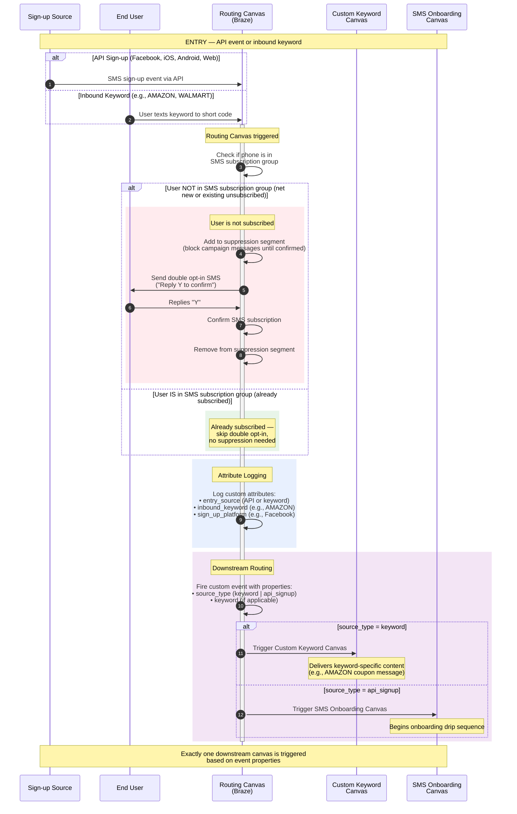
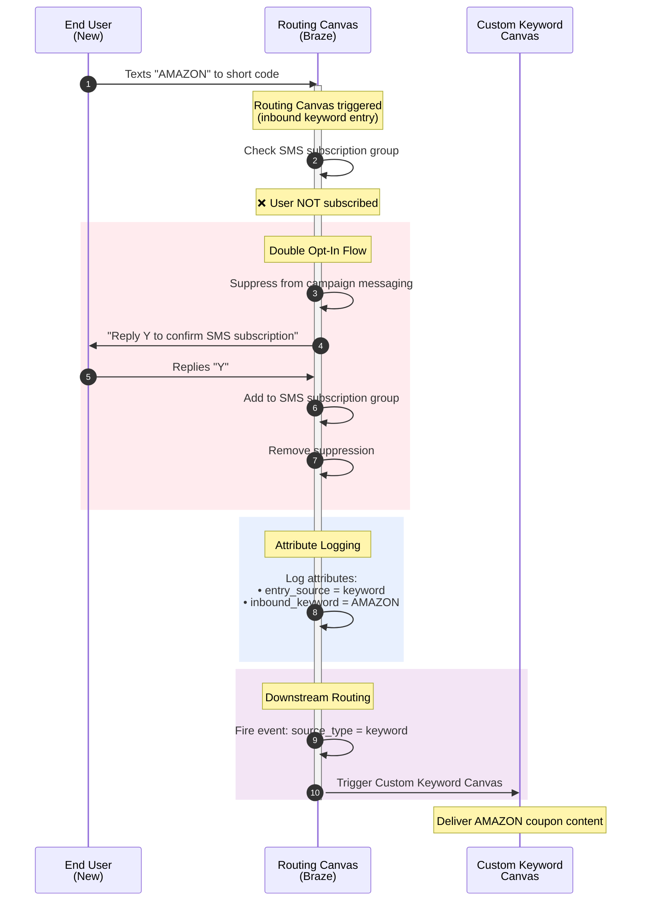
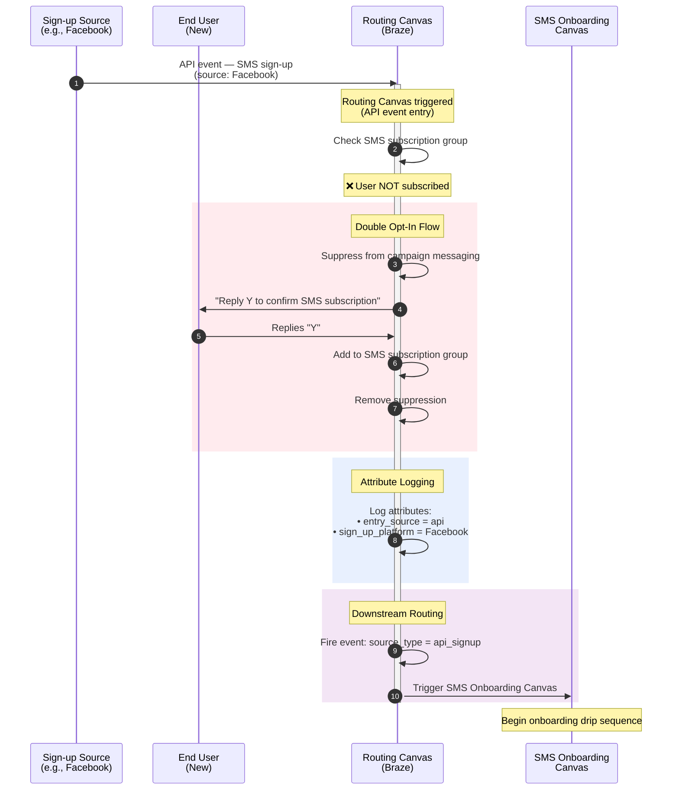
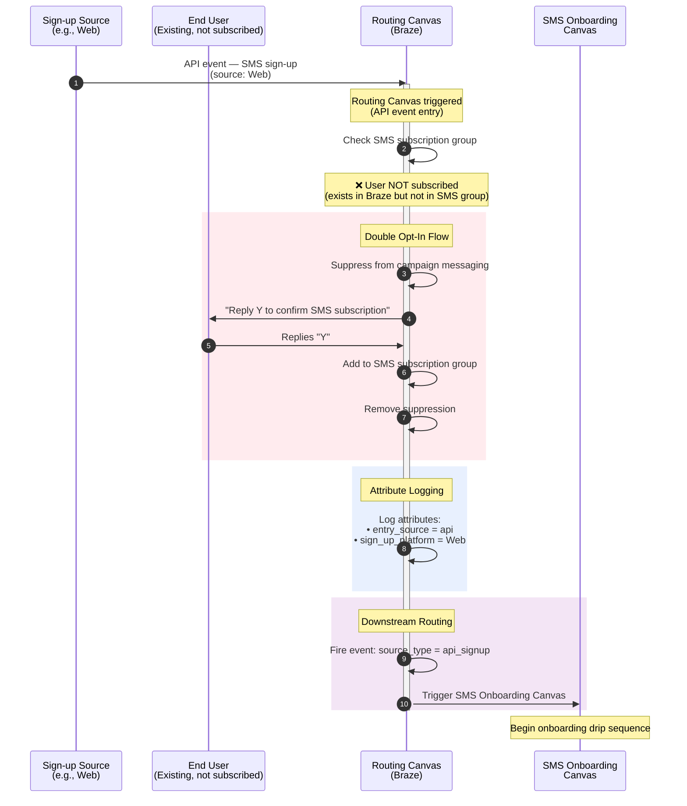
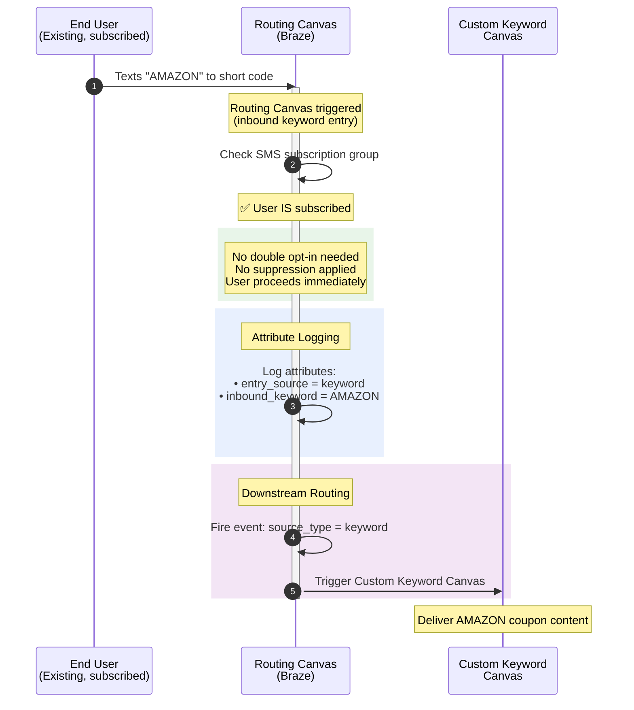
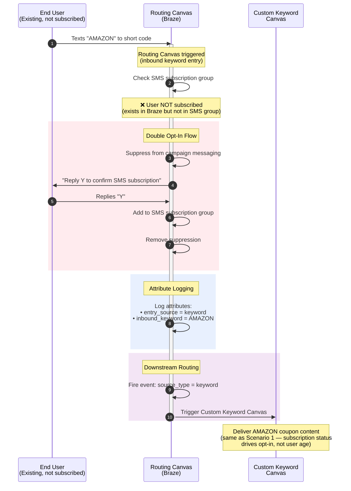

# Braze SMS Opt-In Routing Canvas — Sequence Diagrams

This document describes the **single Routing Layer Canvas** that acts as the entry point for all SMS sign-ups. The diagrams below cover the double opt-in orchestration, attribute logging, and downstream routing logic across five key scenarios.

---

## Participants

| Actor | Description |
|---|---|
| **Sign-up Source** | External trigger origin — API events from Facebook, iOS, Android, Web, or an inbound keyword |
| **End User** | The person signing up or texting a keyword |
| **Routing Canvas (Braze)** | The single entry-point canvas that manages opt-in checks, double opt-in, attribute logging, and downstream routing |
| **Custom Keyword Canvas** | Downstream canvas for keyword-specific content (e.g., AMAZON coupon) |
| **SMS Onboarding Canvas** | Downstream canvas for general SMS onboarding sequences |

---

## Comprehensive Overview

[Open in Mermaid Live Editor](https://mermaid.live/edit#pako:hVZta9tIEP4rgz7Z4PR6TgJtuAu4jguhTXxYCUcOg1lJY3mxtLvdFye-tv_9ZleSJTluTh8EWs3bM8-87PcolRlGVxAZ_OZQpHjDWa5ZuRRAD3NWClcmqJeiOlFMW55yxYSFOAZmIOa5OHMKYul0iq-lZo9eaiYyeDTezvH_xdT_X0hnuchhysSOmT8S_dv14JNm_-Lwtcb0S1CZOmNlCV9w_yx1FlQq7RORzoNGfBfDXCSS6Yx89TQqnXtpEeQONWEbkdIVzO4fFk-wdOP3v1_A5K9bwB2SQamBkyFHqLaV_8YEK2yQa9Iy-MxSTKTcjoDP4xFMRKYlz0bwNyY1Nv_E8dn19YIc-hhNrVv52nHmLVayWBiE29p1DR0G-C5_R6bvJv_M78ny5OvdZPHQsT57rK17CsDiizVN3GAlmI3UFnwl1E5ECye1fMcoK4vpcYq8vT5tYDXPc9R4UF9Ma8fTDaZb4GtQGykQuKH8BQICXpeYVHNluRSQa-lUN5sh5vv5A2nAaWkYCLQg8Nnzgi_chJicqCUTzDq50Jha0HkyGF9ejmB8Hl4fOgJ9hME7hSukhdZeK31AOMmqXDqlNBrjgzOYl8RgVc1JISkDKSsVI3qhJBmWo6EwLS8o-WLNddmLNJiePVJNECGQSZcUFJiyZ1UiKrPLaIGq2MOTd15bWUanuPdynBwuo6dldALAtFJ-leMTogssKUGw1tR_JwC3GqGSDnUbcnkbv0UkKzSybA__Q935mFi7CNSd_5K6yStbdSOHzJktV_2kjsK56HMoELMu3y2itkmO43pPr8uL4amGmVjqkcTR0VeZ51SmR31Cp5BWg401ouYqBOZjH4_Jr9X7lQnTFgZ-1FDR18087ArWA2q1PTUlepJ-3qycWqmC2bWkEqhFm9E1fAPxxTmBHX8MdJxEfCOfhbHERNlMiyPIn7nGBnM18Z653YDSUiGN8CP4FfCV3StC30D7AUzxlYfhVA_ZATtNHqao_lNGfA-746Vr8M92mvdqnjbOFTxUw-1o70B35_TRB60bLDh9HObtmVGY8jVPfbPaw3TockN_nJKHETHsdFA_2Bb0UbxhdTXx9rfeG_EGrU9IVWlAtgoZtSg014NOJRyVRIa9XfHLhfpCYjSv_BbI2tJIqwXCOzskJCZhhtqWklFVRlsU0QiiEnXJeEbXl--R3WAZLjIZrpkrbPSTBPz9Jd6LlM6tdkgnTmUUYX3JqY9__gc)

This diagram shows the complete routing logic with all branching paths.

---

## Scenario Diagrams

### Scenario 1 — New user texts coupon keyword before double opt-in

[Open in Mermaid Live Editor](https://mermaid.live/edit#pako:fZTbbtpAEIZfZeQrkBI1MqC2qEGihkhVGpBMuEhlCa3twayCd7d7gNIo795ZGyPikHJh4fE_s9-c9iXIZI7BEAKDvx2KDCecFZqViQD6MWelcGWKOhG1RTFtecYVExamS2AGpiKHpUH9LdWfRp0Z7rvvlXHklbF0losCIiZ2zNT675r9xQse0X3lEjljZQn3eNhLnVcutXfDM11ej0ZxNIRH_GMNJMH4YfxrPksCsBLMRmoLPsNGzjLLd8wiEdWGmaQXuUMNPshbQrCaFwVqrA_ucJFKR9k-1zSAwupDtwkdR0eSaIPZMyweFmBcajLNleVSQKGlU5cOTVz4uZ9VNYTZ_LHxSjFvQmvMLOgi7YSDwRWEverxpXsp2ES6dIswV_b6h4C7rdy36BZOKY3GwFpTYTNWKsYLASWZWEG5n8mnS4ILYlTbAzz5emZSrLku3-WWBK1meB-Ovh1PzbcTwDjPfaz_1eekjbGkzEhXM_ujKgGKC7XphVSW_g09Bv2LtRlbamjqyPRTFq1c_XeyAms0Zlg1nZpzE4Z1q1dGOp0h3DYTcK44DseqGY5bOE7ix8D9HrGGXz314INm7oWxGlnZTGaL-I5rBNwR3RBquJU9qDPCMz1tFG1JPdGtvYJmp06o_k-Ob7alDVjFm-CW-5c6VxoQp6iVNCeWmIIrCErUJeM53TAvgd1gWd01Oa6Z29rglQT-ilkcREZ2qx2SxamczjzeQ0fz6z8)

A brand-new user (not in Braze or not in the SMS subscription group) texts a keyword like **AMAZON**. They must complete the double opt-in before receiving keyword content.

---

### Scenario 2 — New user subscribes through standard API double opt-in

[Open in Mermaid Live Editor](https://mermaid.live/edit#pako:fVRhb9owEP0rp3xqJei6ANqGViRKQaq0wUTKh0pIyHGO1CqxPccG0ar_feeYUKCskRLB-d7du3fne424yjDqQlTiX4eS451guWHFXAI9zFklXZGimctg0cxYwYVm0kKSACshEblsOg2Jcobjz9R86V3gVX7VgBHjmCr1fPkROpx56FBmMCvRBNAYN2c8pwPvOVXOCpnDgMk1K4P_rWEveAaRTCpI8juBiUwVMxkhK0hA16UkSbPXmw660P9zD7hGgs5dfP21XUHLUFZIVVa1dQ8r2gnErVgzi0QzGMaK_qg1GvCRj2mDNSLP0WAWor7npdds90Gngx2xwRPy58DGpSU3QluhJORGOX0uHdH_1uaVpDCePNSoFLM6tEFuweTpRdzpNCBuVZ_vl-eC3SmXrhAm2jbvJYxWanPCLnFaGyxLWBpVAGeFZqQZFGRiOVV94D6cEbloinq1hUewCriSS2GKD7XNo4AaznZJPEZgSejH-mxPoJ9lPtZn-ux9p1hQZeQXOPtUlQPKM9q0YpKlfU2fTvusNn1LrUwdmX6p_KRWf05WYLVP2a3a7WcrjkOrF2Gg4AaYFoenfuoWTi_0itmlIoFu9jP3Cd92i6jGPzzpzn96uZGlNciKeiRPCI-EwTCLXQjcFnardwQXntWRonTFuvAQpvnkokF9yfZs_Y8Mj27KKccq3i2SkqDeI2XUUKj3UtSAqEBTMJHRunqN7BMW1eLKcMncykZv5OD3VbKVnOzWOCSL0xkl3S21nfntHw)

A new user signs up via an API source (e.g., Facebook lead form, website form). They go through double opt-in and enter the general onboarding sequence.

---

### Scenario 3 — Existing user (not subscribed) subscribes through standard API double opt-in

[Open in Mermaid Live Editor](https://mermaid.live/edit#pako:fVR_SxtBEP0qw_2lEK09E9qGKmiMILSm5AxFCIS928m5NLe73R-xqfjdO7t7iSamHtyRzM6befNmdp6ySnHM-pBZ_O1RVnglWG1YM5VAD_NOSd-UaKYyWTQzTlRCM-mgKIBZKEQtj7yGQnlT4dfSfDg_wOP6uAM_sTx8ixpOAmooOUwsmuQ__COsE7LugFQOrC9tZUSJfA98PAjwsfLBHwZMLplNQS4N-4t7EMUoQorvBYxkqZjhhIyQhF6XVhRH5-fjQR8uftwALpGgU5-ffOxGqE1lplQ21tpvK2y1qpxYMofEMBluFf1RSzQQgm4zBmdEXaNBngK-pKTXrDZBx4OW0-ABq1-JSFJHO6Ek1EZ5vS8dMf_UraLEcDu6e6Vp26GguAUhIcoGpXdRezKEJDHuhoXByoGpy4O81-tAfho_nw_35b1SvlwgjLQ7upFwvVCPO4UUXmuD1sLcqAYq1mhGykJDJlaTQK_chxOqIxujXqzgHpyCSsm5MM0bGaZZQg0nbZKAEWgJfb8-2xC44DzEek_Kje8YG6qM_BLnkCo6oORvtTnNSZbuCX163b3aXDjqOgmN8E3VO7WGc7ICW_vYfmxUmMA8T1MxS2MHZ8C0eH0aZnPm9UwvmJsrEugsTOY7VLunxDL_Evj2_tPGR2mdQdasB3eH67UwmCa2D4nWzK10y20WCG2JSXewD3dp5nduIqxv4YZt-MFx6z7tcozxLpFEBPUSiVMvYb3Isg5kDZqGCU777SlzD9jETcdxzvzCZc_kEBZcsZIV2Z3xSBavOSVtt2Brfv4H)

An existing Braze user who is **not** in the SMS subscription group signs up via an API source. The flow mirrors Scenario 2 — subscription status drives behavior, not user age.

---

### Scenario 4 — Existing user (already subscribed) texts coupon keyword

[Open in Mermaid Live Editor](https://mermaid.live/edit#pako:dZRtb9owEMe_yimvQKIaCqBpaEVigUlTVybBeDMhISe-BavE9s42bVb1u_fyNFFG88KKL_fw8__OeY4yIzGaQuTwT0Cd4UKJnESx08CPCN7oUKRIO91YrCCvMmWF9rDcgnCw1BK2DulzSh9mveWTcl7pfAAupC4jlaLs_x-6TqrQtQmVLyRCn4RrEnwh8RevRCR3dUgSnDcF3GH5aEjWIU10B7jc3sxm62QKP_HJO9hF8_v5rx-rXQTegDsY8lAduXMXmVcn4ZGJGsPK8MackKBK8pYQPKk8R8KmcE_p1AQ-_kNDA6g9lf0u9TppSZIDZg-wud90mlivjIacTLDXiu5C_HE4qUWFb5szIbvMhJkHytNePIoHEI8nvIxG_Wu5VgakCemRTdbfKA0aUbb8_M0Fawmdq3iEtUfVfqprWzIZeztQRYFSsUrHsqmB-l2WIS-T8VWWuWf90sCm7ybPWdYLndgKovNx0xqEtRjGcaPs3plAGcJtJ_i5R9uLfdeLW2gb_z7weMSs8adawavAC_OonScURTcIF8RfFSHgiemm0MDtfWnPCM_8eYB5KJsBuhhj6Eb4H2r1IvHNcF4C1vkWeFTVpjkrT3aw3MnMaM9M0QCiAqkQSvINf478AYv6rkv8LcLRRy_sUF3xTakztnsKyJZgJdds_wOt-eUV)

An existing user who is **already subscribed** to SMS texts a keyword like **AMAZON**. They bypass double opt-in entirely and go straight to keyword content.

---

### Scenario 5 — Existing user (not subscribed) texts coupon keyword before double opt-in

[Open in Mermaid Live Editor](https://mermaid.live/edit#pako:fVRtT9swEP4rp3yiEmgQWm2rRqUuFGligNTSD0yVKsc5gkVjZ_a5UBD_fee4qUop64eoudzLc889d6-JNAUmfUgc_vWoJZ4rUVpRzTTwT3gy2lc52pmOllpYUlLVQhOMpiAcjHQBU4f2R26_DA5Gz8qR0uUhaEPgfO6kVTkWnY_h4yyEj40P_pAJvRQuJvlpxQvuicgum5DMOzIVXOLqydiiCYnRLcjR9GgwGGd9uMVncjBLhlfDPzfXswTIgHswliC03boLSWopCBlRNFwbfjFLtBCSvEcIZFVZosVY-EDp3Him4DGiAdRkV5029ThbI8keUD7C5GrSclKTMhpKa3y9r-jMp1-7siEWrm9ut5iMZTHw7EBpaMiC3FPDOBtCkSbvBoVFSWDL_CDt9Q4hPW0e3zr76p4bny8Qbmo6-qXhYmGedhqZ-Lq26BzcW56BFFUtVKmhYpMomaYt99GU-0jGWC9WcBeol0bfK1t9oGGW7MwtxCgMk7trv20ADIsi5PoflRvfMVbcGftFzKFU44C6-MjNacq0dI_50evu5WZIPHsmGuG3KXd6Dd_ZCqL1cf1mUDzH4zSNqpg7461EOGvFsu2x1tG81dEZrEX7OeDuKWNNvwfUvU-G-aQdWRRVK-IdxBfKIuCS0fUhgpvTqt5CuOXPy8cLFcW_s4LQrt8GavhT4LvF2gXY5DvHhQovsVcWiK95lKwTYkxR6U5UGLZ-IlELqwychOU4Pum-H78jQT7ej8JyTgeGNax0PEQ-7JEosZMcQlKhrYQq-Oq9JvSAVXP_CrwXfkHJGzuEszdZacl2sh7Z4uuC-1jfxrX57R8)

An existing Braze user who is **not subscribed** to SMS texts a keyword like **AMAZON**. They must complete double opt-in first, then receive keyword content.

---

## Scenario Summary Matrix

| # | User Status | SMS Subscribed? | Entry Type | Double Opt-In? | Downstream Canvas |
|---|---|---|---|---|---|
| 1 | New | No | Keyword (AMAZON) | Yes | Custom Keyword Canvas |
| 2 | New | No | API (Facebook) | Yes | SMS Onboarding Canvas |
| 3 | Existing | No | API (Web) | Yes | SMS Onboarding Canvas |
| 4 | Existing | Yes | Keyword (AMAZON) | No | Custom Keyword Canvas |
| 5 | Existing | No | Keyword (AMAZON) | Yes | Custom Keyword Canvas |

### Key Takeaway

The **SMS subscription status** — not whether the user is "new" or "existing" in Braze — determines whether the double opt-in flow is triggered. The **entry type** (keyword vs. API sign-up) determines which downstream canvas is activated.

---

## Next Steps

### 1. Create and Configure the Routing Canvas
- Build the single Routing Canvas in Braze with two entry triggers:
  - **API-triggered entry** for sign-ups from Facebook, iOS, Android, and Web
  - **Inbound keyword entry** for custom keyword responses
- Add a **Decision Split** step checking SMS subscription group membership
- Configure the **double opt-in message step** with a "Reply Y to confirm" template
- Add a **User Update** step to add confirmed users to the SMS subscription group
- Implement **suppression logic** (add to suppression segment on entry for unsubscribed users; remove upon confirmation)
- Add **Custom Attribute** steps to log `entry_source`, `inbound_keyword`, and `sign_up_platform`
- Add a **Custom Event** step to fire the downstream routing event with `source_type` and `keyword` properties

### 2. Update Existing Downstream Canvases
- **Custom Keyword Canvas**: Remove all single opt-in steps (contact card layers, opt-in confirmation, subscription updates). The Routing Canvas now handles all of this.
- **SMS Onboarding Canvas**: Same cleanup — remove opt-in logic. This canvas should assume the user is already double-opted-in when they arrive.

### 3. Set New Downstream Triggers
- Change the **Custom Keyword Canvas** trigger to: custom event from Routing Canvas where `source_type = keyword`
- Change the **SMS Onboarding Canvas** trigger to: custom event from Routing Canvas where `source_type = api_signup`
- Both triggers should be able to access event properties (e.g., `keyword`, `sign_up_platform`) for message personalization

### 4. Finalize Trigger Logic for Existing Subscribed Users
- Existing subscribed users who text a keyword must still flow through the Routing Canvas (to log attributes and fire the downstream event) but **bypass** the double opt-in entirely
- Verify that re-engagement with a keyword correctly triggers the Custom Keyword Canvas and delivers the expected content without any opt-in friction
- Consider rate-limiting or deduplication if a subscribed user texts the same keyword multiple times

---

## Custom Attributes & Event Properties Reference

### Custom Attributes (logged on user profile)

| Attribute | Type | Example Values | Purpose |
|---|---|---|---|
| `entry_source` | String | `keyword`, `api` | How the user entered the SMS program |
| `inbound_keyword` | String | `AMAZON`, `WALMART`, `DEALS` | The specific keyword texted (if applicable) |
| `sign_up_platform` | String | `Facebook`, `iOS`, `Android`, `Web` | The API source platform (if applicable) |
| `sms_opt_in_date` | Date | `2026-03-18` | When the user confirmed their subscription |

### Custom Event Properties (passed to downstream canvases)

| Property | Type | Example Values | Purpose |
|---|---|---|---|
| `source_type` | String | `keyword`, `api_signup` | Determines which downstream canvas to trigger |
| `keyword` | String | `AMAZON` | The keyword for content personalization |
| `sign_up_platform` | String | `Facebook` | The originating platform for analytics |
